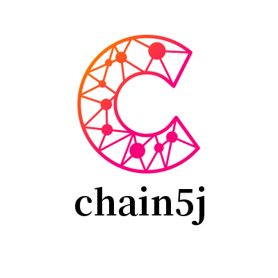

# chain5j-pkg
## 简介
`chain5j-pkg` 是一个区块链相关的工具包集合。能便捷区块链开发过程中对相关工具的使用。

## 功能
- 命令行：[cli](cli/cli.go)是对`cobra`的封装；
- 编码：[codec](codec/codec.go)对编码器进行接口抽象。其中[codec/json](codec/json)是json编码的封装，[codec/rlp](codec/rlp)是rlp编码的封装；
- 数据结构：[collection](collection)是对map、tree、stack、queue等的封装；
- 密码学：[crypto](crypto)是对密码学算法的封装，其中包含有base编码、hash算法、签名算法等封装；
- 数据库：[database](database)是数据库封装。当前已完成对kv数据库接口化，并完成levelDB的对接；
- 事件订阅：[event](event)是feed事件订阅的封装

## 安装使用

```shell
go get -u github.com/chain5j/chain5j-pkg
```

## 证书
`chain5j-pkg` 的源码允许用户在遵循 [Apache 2.0 开源证书](LICENSE) 规则的前提下使用。

## 版权
Copyright@2021 chain5j

